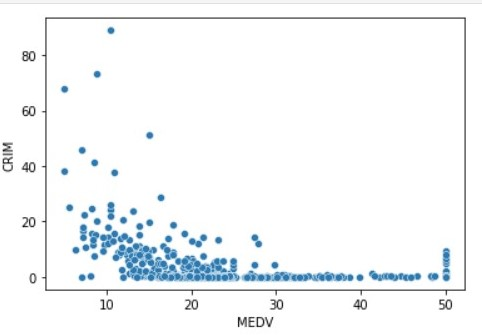

# aparajita37.github.io

# My Portfolio
A unique IT professional delved into the domain of social research to weave and articulate a compelling story around data for its maximum impact.

## [Project 1: Customer Segmentation](https://github.com/aparajita37/Customer-Segmentation)

### Context

* Customer segmentation is the process of dividing a dataset of customers into groups of similar customers based on certain common characteristics, usually for the purpose of understanding the population dataset in a better fashion. Customer segmentation is often viewed as a means to achieve a better return on investment from marketing efforts. Typically, the variables of interest are customer profiles, campaign conversion rates, and information associated with various marketing channels. Based on these feature categories, the target is to create the best possible customer segments from the given data.

### Objective 

* Using Unsupervised Learning ideas such as Dimensionality Reduction and Clustering, the objective is to come up with the best possible customer segments using the given customer dataset.

 Segments using K-Means Algirithm(K=3) and PCA. 

  

    

  Segments using K-Means Algirithm(K=5) and PCA. 

 

    

  Segments using K-Medoids Algirithm(K=5) and PCA. 

    

## [Project 2: Boston Housing Prices](https://github.com/aparajita37/Boston-Housing-Prices-Analysis)

### Context

* Data Dictionary Each record in the database describes a house in a Boston suburb or town. The data was drawn from the Boston Standard Metropolitan Statistical Area (SMSA) in 1970.

### Objective 

* The problem at hand is to predict the housing prices of a town or a suburb based on the features of the locality provided to us. In the process, we need to identify the most important features affecting the price of the house. We need to employ techniques of data preprocessing and build a linear regression model that predicts the prices for the unseen data.

  Scatter plot between Per Capita Crime Rate and Median value of owner-occupied homes. 

 

    

 Scatter Plot between Fitted Values and Residuals. 

  

    

